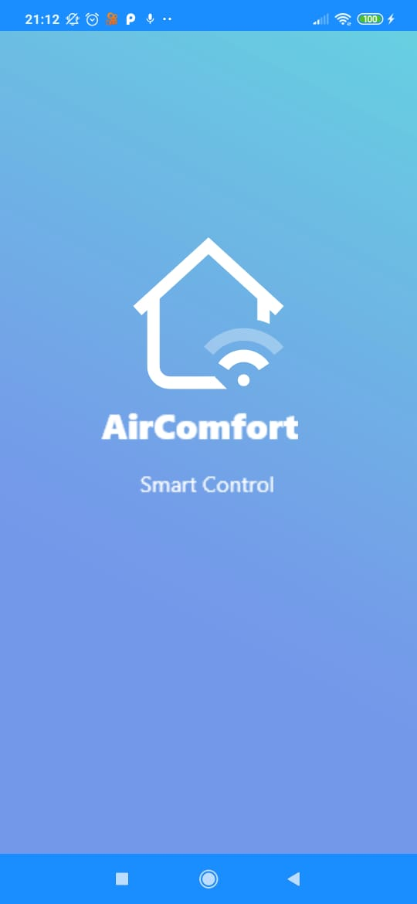
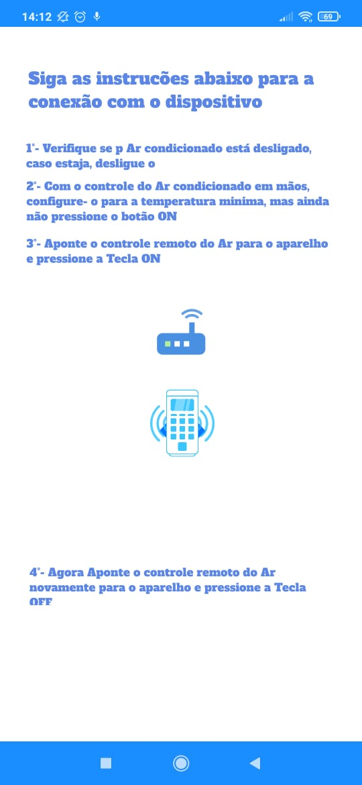
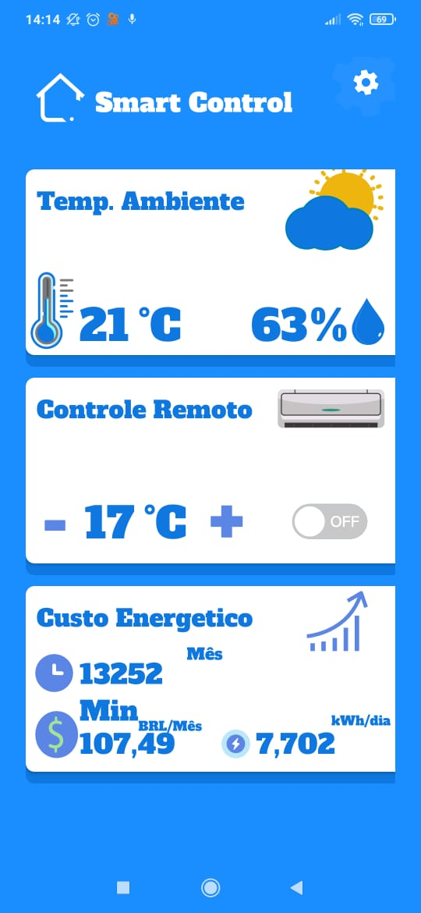
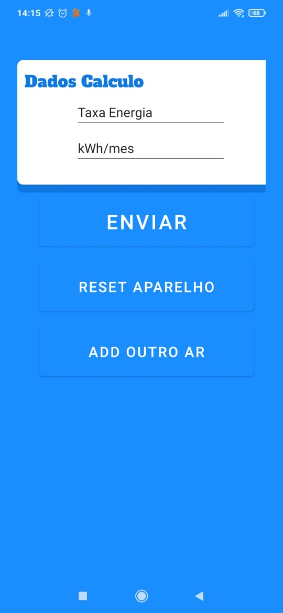

# AirComfort - SmartControl

> Projeto consiste na criação de um dispositivo de controle inteligente IOT, para aparelhos de Ar-Condicionado Split, fazendo com seja substituido o controle original do aparelho split, foi um Smartphone.

> Caracteristicas e funcionalidades do Dispositivo AirComfort
 * Fácil instalação
 * Funcionamento a bateria ou ligado direto a energia eletrica
 * Funcionamento dependente da bateria por 1 mês
 * Leitura de temperatura ambiente
 * Leitura de Umidade do ar ambiente

> Caracteristicas e Funcionalidades do Software SmartControl
* Fácil instalação
* Fácil sicronização entre software e dispositivo.
* Informa temperatura ambiente
* Informa umidade do ar ambiente
* Gera calculo de gasto do aparelho split mensal
* Mostra consumo diario em kwh
* Mostra tempo de uso
* Gera grafico de consumo diario.
 
## Funcionamento Aplicativo SmartControl

  

 

## Fluxograma Software SmartControl

>SplashScreen

>Sincronização de Dispositivos

>Main

>Configuração de dispositivos

